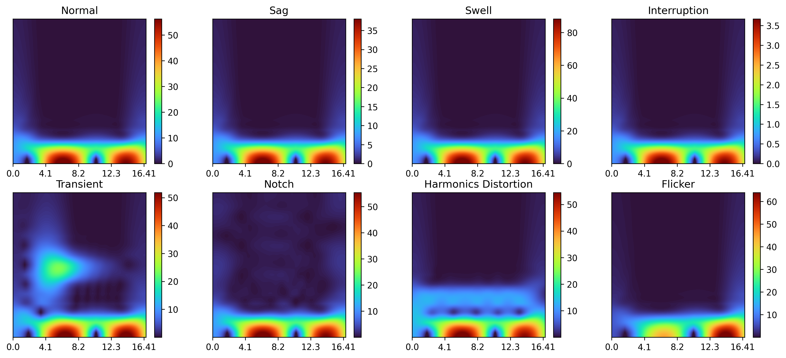
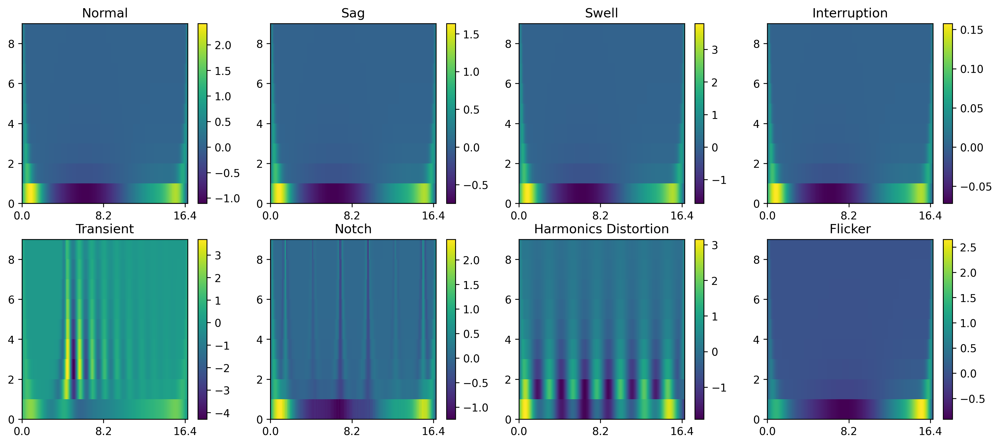
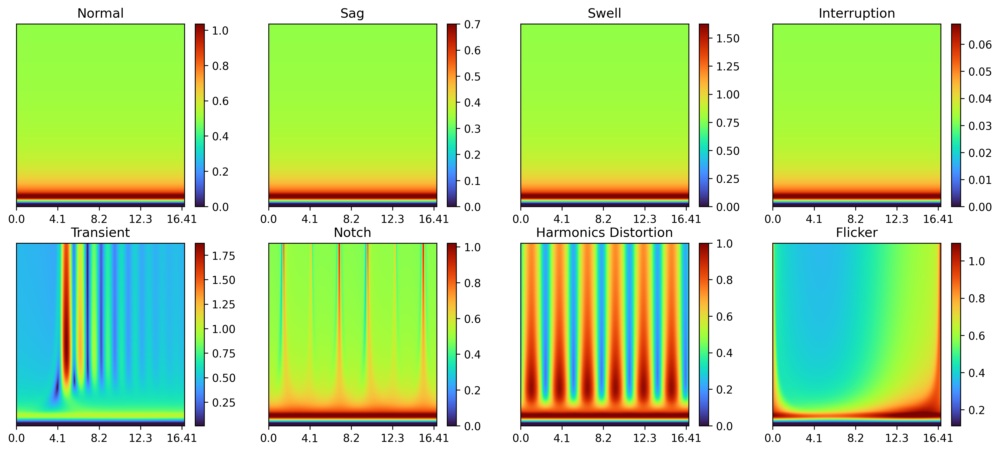
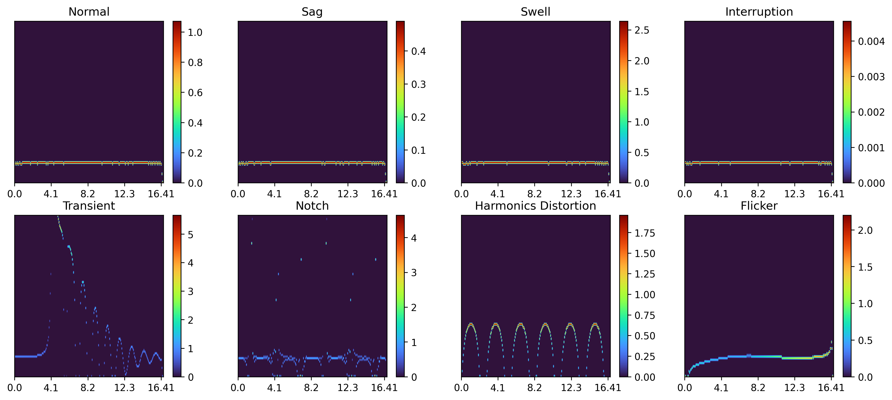
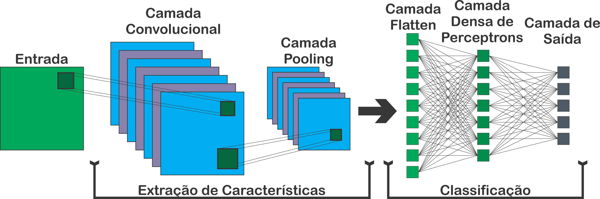

# Introduction

This repository presents a classification algorithm for Power Quality (PQ) events using Artificial Neural Networks (ANNs). It utilizes four spectrum analysis techniques: (i) Short-Time Fourier Transform (STFT), (ii) Continuous Wavelet Transform (CWT), (iii) Discrete Stockwell Transform (DST), and (iv) Hilbert-Huang Transform (HHT). These spectra are used as input to a Convolutional Neural Network (CNN) for event classification.

## Methodology

### Signal Generation Models

PQ events were simulated using a numerical model (refer to [1]). The simulated events include:

- **Sag**: Voltage dips between 0.1 and 0.9 pu
- **Swell**: Voltage rises between 1.1 and 1.8 pu
- **Interruption**: Voltage drops below 0.1 pu
- **Transient**: Sudden voltage deviations
- **Notch**: Rapid drops and recoveries in voltage, often due to switching
- **Harmonics**: Multiple frequency components causing signal distortions
- **Flicker**: Long-term voltage variations causing visible light fluctuations

Equations for these events are in `src/data_gen.py` and in the table below.

| **Name**      | **Equation**                                                                                     | **Range of** $\beta$                                |
|---------------|--------------------------------------------------------------------------------------------------|-----------------------------------------------------|
| Normal        | $V(t) = \sin(wt + \alpha) \left(1 - \beta \cdot u(t-t_1) \cdot (1 - e^{t - t_1})\right)$          | $\beta \in [0.93, 1.07]$                            |
| Sag           | $V(t) = \sin(wt + \alpha) \left(1 - \beta \cdot u(t-t_1) \cdot (1 - e^{t - t_1})\right)$          | $\beta \in [0.1, 0.9]$                              |
| Swell         | $V(t) = \sin(wt + \alpha) \left(1 + \beta \cdot u(t-t_1) \cdot (1 - e^{t - t_1})\right)$          | $\beta \in [1.1, 1.8]$                              |
| Interruption  | $V(t) = \sin(wt + \alpha) \left(1 - \beta \cdot u(t-t_1) \cdot (1 - e^{t - t_1})\right)$          | $\beta \in [0, 0.09]$                               |
| Transient     | $V(t) = \sin(wt + \alpha) + \beta_{1}\cdot u(t-t_1) \cdot e^{-\beta_{2} (t-t_1)} \cdot \sin(w_{os}(t - t_1) + \alpha_{os})$ | $\beta_{1} \in [1.2, 2]$, $\beta_{2} \in [200, 600]$|
| Notch         | $V(t) = \sin(wt + \alpha) + [n_d \cdot p_m(v_n, v_{osc})]$                                        | $n_d \in [0.2, 0.5]$                                |
| Harmonics     | $V(t) = \sin(wt + \alpha) + \sum_{n=1}^{N} a_n \sin(n \cdot (wt + \alpha))$                       | $Thd \in [0.1, 0.5]$                                |

### Spectrum Analysis Techniques

#### Short-Time Fourier Transform (STFT)

STFT provides time-frequency analysis using sliding windows. It’s computed using `librosa` in `src/signal_processing/compute_stft`:

$$
X[k, n] = \sum_{m=0}^{N-1} x[n+m] \cdot W[m] \cdot e^{-j\frac{2\pi mk}{N}}
$$

#### Continuous Wavelet Transform (CWT)

CWT analyzes frequency evolution using wavelets, offering better resolution than STFT. It’s computed in `src/signal_processing/compute_cwt`:

$$
X[a, b] = \frac{1}{\sqrt{|a|}} \sum_{n=0}^{N-1} x[n] \cdot \psi^* \left(\frac{n - b}{a}\right)
$$

#### Discrete Stockwell Transform (DST)

DST combines STFT and CWT advantages for efficient time-frequency analysis. It’s computed in `src/signal_processing/compute_st`:

$$
S[k, n] = \sum_{m=0}^{N-1} H[n+m] e^{\frac{-2\pi^2 m^2}{n^2}} e^{\frac{j2\pi m k}{N}}
$$

#### Hilbert-Huang Transform (HHT)

HHT analyzes nonlinear or non-stationary signals using Empirical Mode Decomposition (EMD) and Hilbert Transform. It’s computed in `src/signal_processing/compute_hht`:

$$
x(t) = \sum_{i=1}^{N} c_i(t) + r(t)
$$

$$
A_i(t) = \sqrt{c_i^2(t) + \left( \mathcal{H} \left\{ c_i(t) \right\} \right)^2}
$$
$$
\phi_i(t) = \arctan \left( \dfrac{\mathcal{H} \left\{ c_i(t) \right\}}{c_i(t)} \right); \; \omega_i(t) = \dfrac{1}{2\pi}\dfrac{d\phi_i(t)}{dt}
$$

$$
H_i(\omega, t) = A_i(t);\; \omega_i(t)
$$

### Convolutional Neural Network (CNN)

The CNN architecture used by the project for classification consists of:

| **Layer Type**         | **Parameters**             | **Activation** |
|------------------------|----------------------------|----------------|
| Input Layer            | Input\_Size                | -              |
| Convolution Layer      | filters=20, kernel\_size=3 | ReLU           |
| Max Pooling Layer      | pool\_size=2               | -              |
| Convolution Layer      | filters=10, kernel\_size=3 | ReLU           |
| Max Pooling Layer      | pool\_size=2               | -              |
| Flatten Layer          | -                          | -              |
| Dense Perceptron Layer | units=num\_classes=8       | Softmax        |

